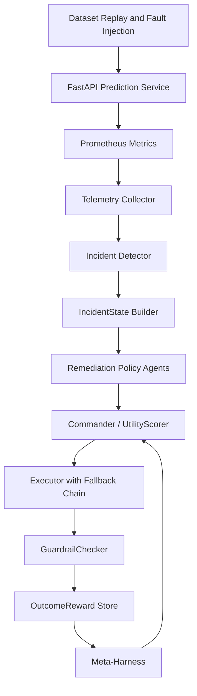

# Autonomous ML Operations Control Plane

A closed-loop ML operations system that detects model and data incidents,
evaluates competing remediation strategies using tenant-specific utility
weights, executes the selected action, and verifies whether the incident
was actually resolved — rolling back automatically if guardrails fail.

---

## Motivation

Production ML incidents rarely have a single obvious solution.

A drop in model quality might be addressed by:

- changing the decision threshold
- retraining on newer data
- rolling back a recent model deployment
- temporarily switching to a fallback policy
- repairing corrupted input data

These options differ in cost, risk, execution time, and expected impact.
This project explores whether specialized remediation policies can compete
across these tradeoffs while a central controller selects and verifies
the best action — and whether that beats naive baselines.

---

## Design Principle: Competing Remediation Policies

The agents in this system do not chat or delegate tasks to one another.

Each agent represents a distinct remediation strategy with its own
eligibility rules, state inputs, expected effects, confidence estimate,
execution cost, and operational risk. The commander converts each proposal
into a utility score under the tenant's objective weights, selects the
highest-scoring agent, and verifies the outcome after execution.

---

## System Architecture

```
Dataset Replay / Fault Injection
              │
              ▼
     FastAPI Prediction Service  ─── Prometheus metrics
              │
              ▼
      Telemetry Collector
              │
              ▼
   Incident Detector (4 types)
              │
              ▼
       IncidentState Builder ──── SQLite (policy DB, model registry)
              │
              ▼
  ┌──────────────────────────────┐
  │   Remediation Policy Agents  │
  │ Threshold │ Retrain │ Rollback│
  │ Fallback  │ DataRepair        │
  └──────────────────────────────┘
              │
              ▼
          Commander
     (UtilityScorer + optional
      LangGraph reconciliation)
              │
              ▼
    Execute ──► Fallback chain ──► Escalation
              │
              ▼
      Stabilization window
              │
              ▼
       GuardrailChecker
   resolved? no_regression?
   should_rollback?
              │
              ▼
    OutcomeReward (SQLite)
              │
              ▼
    Meta-Harness (offline batch)
   WeightTuner ─► CanaryManager
```



---

## Scope and Simulation Boundaries

### Implemented as real system behavior

- LightGBM model training and inference
- FastAPI prediction endpoint with measured latency
- UCI dataset rows replayed as real prediction requests
- Prometheus metric instrumentation and live querying
- Calculated feature drift scores and data-quality metrics
- Windowed model-quality metrics (AUC, precision, recall)
- Tenant-specific configuration and SLA persistence in SQLite
- Threshold updates written to the configuration store
- Model retraining against held-out validation data
- Model version rollback switching active model in registry
- Multi-objective proposal ranking via UtilityScorer
- Post-action state snapshot and guardrail verification
- Auto-rollback when guardrails fail and regression detected
- Outcome reward and evidence bundle persistence

### Simulated

- Production traffic source (historical dataset replay, not live)
- Tenant business profiles (documented cost model, not real billing)
- Infrastructure cost (calculated per prediction, not cloud metered)
- Fault injection (controlled scripts, not spontaneous failures)
- Upstream warehouse repair (replay environment, not real pipeline)
- Production-scale deployment infrastructure

The environment is simulated, but telemetry is computed from actual model
requests and injected data conditions rather than generated as random mock
values.

---

## Model and Dataset

| Property | Value |
|---|---|
| Dataset | UCI Default of Credit Card Clients |
| Rows | ~30,000 |
| Features | 23 |
| Model | LightGBM binary classifier |
| Task | Predict credit-card default probability |
| Metric | ROC-AUC |
| Baseline ROC-AUC | ~0.77 |

The dataset is split into training, baseline calibration, and replay partitions.
The replay partition is sent through the real prediction API to generate runtime
telemetry.

---

## Baseline and Threshold Initialization

Tenant configuration values are derived from model evaluation and runtime
benchmarking, not hardcoded guesses.

| Configuration | Source |
|---|---|
| `baseline_auc` | Validation set evaluation |
| `min_auc` | Baseline minus tolerated degradation |
| `decision_threshold` | Threshold search on validation data |
| `baseline_latency_p95_ms` | Measured inference benchmark |
| `latency_sla_ms` | Baseline plus tolerance or explicit SLA |
| `max_missing_rate` | Operator-defined data-quality limit |
| `daily_cost_budget_usd` | Tenant business profile |
| `false_positive_cost` / `false_negative_cost` | Tenant business profile |

Business limits remain operator-defined because they represent requirements,
not model properties.

---

## Multi-Tenant Configuration

One shared model; per-tenant policy, thresholds, SLAs, and cost weights.

| Tenant | Priority | Latency SLA | Primary Risk |
|---|---|---:|---|
| Enterprise | Model quality | 150 ms | False negatives ($5,000 each) |
| Standard | Balanced | 100 ms | Quality and latency |
| Free | Cost | 200 ms | Inference expense |

Commander utility weights are also per-tenant: a cost-sensitive tenant may
prefer threshold adjustment for the same drift incident that triggers
retraining for an accuracy-sensitive tenant.

---

## Observability

### Model-quality metrics
- `ml_model_auc`, `ml_model_precision`, `ml_model_recall`
- `ml_false_positive_rate`, `ml_false_negative_rate`

### Data-quality metrics
- `ml_missing_rate`, `ml_duplicate_rate`, `ml_schema_violations_total`
- `ml_batch_volume`, `ml_feature_drift_score`, `ml_max_feature_drift_score`

### Prediction metrics
- `ml_predictions_total`, `ml_prediction_latency_seconds`
- `ml_prediction_errors_total`, `ml_positive_predictions_total`

### Control-plane metrics
- `ml_remediation_proposals_total`, `ml_agent_wins_total`
- `ml_incidents_total`, `ml_remediation_duration_seconds`
- `ml_remediation_reward`, `ml_current_decision_threshold`

Metrics are labeled by tenant and model version. High-cardinality values
(request IDs) are intentionally excluded.

---

## Traffic Replay

The replay engine sends held-out dataset rows through the real `/predict`
endpoint. For each request the system records tenant, model version,
prediction probability, class decision, request latency, and error status.

```bash
python scripts/replay_traffic.py --tenant standard --requests 2000
```

---

## Fault Injection Scenarios

| Scenario | Mechanism |
|---|---|
| Covariate drift | Multiply high-importance feature values |
| Missing-data incident | Set selected fields to null |
| Duplicate-data incident | Repeat rows within the replay window |
| Schema incident | Remove required fields |
| Latency incident | Add controlled delay inside inference path |
| Cost incident | Increase traffic volume beyond budget |

```bash
python scripts/trigger_incident.py --type drift --tenant enterprise
```

---

## Incident Detection

The incident detector compares Prometheus snapshots against policy limits
from SQLite. Detected incidents carry severity, affected metrics, baseline
values, current values, and supporting evidence.

```json
{
  "tenant_id": "enterprise",
  "incident_type": "drift",
  "severity": 0.81,
  "evidence": {
    "baseline_auc": 0.773,
    "current_auc": 0.701,
    "auc_drop": 0.072,
    "max_feature_drift": 1.84,
    "drifted_features": ["LIMIT_BAL", "BILL_AMT1"]
  }
}
```

---

## Incident Severity

Severity is computed by a per-type formula with named components.

**Drift severity:**
```
0.45 × normalised AUC drop
+ 0.35 × normalised feature drift
+ 0.20 × normalised affected volume
```

**Data-quality severity:** `0.40 × missing + 0.25 × schema + 0.15 × duplicates + 0.20 × volume`

**Latency severity:** `0.60 × latency_ratio + 0.25 × error_rate + 0.15 × traffic_volume`

**Cost severity:** `0.70 × budget_overrun + 0.30 × cost_growth`

All component values are stored with the incident.

---

## Remediation Policy Agents

| Agent | Action | Eligibility Gate | Key Expected Effects |
|---|---|---|---|
| Threshold | Adjust decision threshold | recall_drop > 5% or fn_cost > $100 | `new_threshold`, `false_positive_rate_delta`, `false_negative_rate_delta` |
| Retrain | Train and register new model | drift > 1.0 or auc_drop > 5pp, data quality ≥ 50% | `auc_delta`, `cost_delta_usd` |
| Rollback | Restore prior model version | deployment < 24 h ago and AUC regressed | `auc_delta`, `false_negative_rate_delta` |
| Fallback | Switch to rule-based policy | error_rate > 15% or latency > 500 ms or missing > 30% | `latency_p95_delta_ms`, `availability_delta` |
| DataRepair | Repair or reload corrupted data | missing > 15% or schema errors > 10 | `missing_rate_delta`, `false_negative_rate_delta` |

Proposal contract:

```json
{
  "agent_type": "threshold",
  "action": "adjust_threshold",
  "new_threshold": 0.43,
  "expected_effect": {
    "auc_delta": 0.02,
    "false_negative_rate_delta": -0.04,
    "false_positive_rate_delta": 0.02,
    "latency_p95_delta_ms": 0.0,
    "cost_delta_usd": 0.0
  },
  "confidence": 0.78,
  "risk": 0.12
}
```

---

## Commander Decision Logic

The commander does not select on confidence alone. It converts each
proposal's expected effects into a tenant-specific utility score:

```
utility =
  quality_weight    × clip(auc_delta / 0.10)
+ reliability_weight × clip(–fnr_delta / fnr_baseline)
+ cost_weight       × clip(–cost_delta / cost_ref)
+ speed_weight      × clip(–latency_delta / sla)
+ confidence_weight × plan.confidence
– risk_weight       × plan.risk
```

Per-incident-type weight defaults:

| Incident | quality | reliability | cost | speed |
|---|---:|---:|---:|---:|
| Drift | 0.40 | 0.15 | 0.05 | 0.05 |
| Data quality | 0.10 | 0.35 | 0.05 | 0.05 |
| Latency | 0.05 | 0.10 | 0.05 | 0.40 |
| Cost | 0.10 | 0.10 | 0.40 | 0.05 |

When top-2 utility scores are within 10%, a LangGraph reconciliation
debate compares guardrails, historical success, and predicted side effects.

---

## Execution

Selected remediations produce actual state changes:

- **Threshold** — updates tenant's active threshold in SQLite
- **Retrain** — runs the LightGBM pipeline, validates candidate, registers new version
- **Rollback** — switches tenant to previous approved model version in registry
- **Fallback** — routes predictions through a rule-based policy
- **DataRepair** — repairs the corrupted replay window and reruns validation

If the selected agent fails, a fallback chain tries the next-ranked agent.
If all agents fail, an escalation record is written.

---

## Post-Action Verification

An action is not considered successful because it executed without error.

The verifier:

1. Records pre-action metric snapshot (`IncidentState` before)
2. Executes the remediation
3. Waits for the stabilisation window
4. Re-queries Prometheus
5. Rebuilds post-action `IncidentState`
6. Runs `GuardrailChecker` against explicit policy limits
7. Accepts or triggers auto-rollback

**Resolution guardrails** (must all pass):
```
AUC    ≥ min_auc
latency ≤ latency_sla_ms
missing ≤ max_missing_rate
```

**Regression guardrails** (vs before-action baseline):
```
cost    ≤ before × 1.10
FNR     ≤ before + 0.05
```

If both sets fail, `should_rollback = True` and the rollback agent is
invoked automatically (if available and if the original action was not
already a rollback).

---

## Outcome-Based Reward

Agent estimates are used for selection; reward is computed only after
verification from real before/after metrics.

```json
{
  "reward": 0.65,
  "components": {
    "quality_gain": 0.52,
    "reliability_gain": 0.18,
    "cost_gain": 0.04,
    "latency_gain": 0.00,
    "resolution_score": 0.80,
    "exec_cost_penalty": -0.04,
    "time_penalty": -0.01,
    "regression_penalty": 0.0
  }
}
```

---

## Policy Adaptation (Meta-Harness)

The meta-harness is an **offline batch system**, not a real-time learning loop.

1. `CommanderV3` writes an evidence bundle (`traces/run_<incident_id>/evidence_bundle.json`)
   after every incident it resolves — winner, proposals, execution result,
   reconciliation outcome.
2. `EvidenceBundleAnalyzer` reads those bundles; computes per-agent success
   rates and confidence calibration accuracy.
3. `WeightTuner` applies scipy t-tests (p < 0.05) and adjusts
   `ScoringWeights` only when the performance difference is statistically
   significant.
4. `meta_harness/apply.py::sync_tuned_weights()` writes the tuned weights
   into each tenant's `TenantTierConfig` row — the same row
   `UtilityScorer.weights_from_tier_config()` reads on every live incident —
   so the next decision actually uses them.
5. `CanaryWeightManager` rolls new weights to a configurable share of
   traffic with automatic rollback if the success rate drops below threshold
   (implemented, not yet invoked by the production entrypoint below).

Run the full offline cycle against the live DB with:

```bash
uv run python scripts/tune_weights.py            # analyze → tune → version → apply
uv run python scripts/tune_weights.py --dry-run   # analyze/tune only, no writes
```

---

## Evaluation

### Scenarios

The system is evaluated across 12 deterministic incident scenarios with
defined pre- and post-action states per agent type. Scenario families:

- Severe drift (model 30 days old)
- Mild drift (threshold sufficient, retrain wasteful)
- Recent-deployment regression (rollback optimal)
- Mild and severe latency breach
- High missing-rate data quality
- Schema-violation data quality
- Cost overrun
- Drift with concurrent data quality issues
- Post-upgrade latency spike
- Near-threshold drift (AUC already above minimum)
- Cost and quality conflict

### Metrics

| Metric | Definition |
|---|---|
| Resolution rate | % scenarios where all policy guardrails pass after action |
| Mean reward | Average outcome-based reward across scenarios |
| Guardrail violation rate | % scenarios with at least one guardrail violation |

---

## Results

| Policy | Resolution | Mean Reward | Guardrail Violations |
|---|---:|---:|---:|
| **Adaptive commander** | **75%** | **0.346** | **50%** |
| Highest confidence | 58% | 0.285 | 50% |
| Always retrain | 50% | 0.186 | 75% |
| Fixed priority | 33% | 0.143 | 67% |
| Cheapest eligible | 33% | 0.143 | 67% |

Results computed from 12 × 5 = 60 deterministic trials
(`tests/test_policy_comparison.py`). "Cheapest eligible" always picks the
lowest dollar-cost eligible agent (threshold at $0 whenever eligible) —
it ties fixed-priority here because both gravitate to threshold first;
it fails severe-drift and deployment-regression scenarios where only
retrain or rollback fully resolve the incident.

**Key failure modes of baselines:**

| Scenario | Adaptive | Always Retrain | Fixed Priority |
|---|---|---|---|
| Deployment regression | rollback ✓ (+0.65) | retrain ✗ (−0.08) | threshold ✗ (+0.09) |
| Severe latency breach | fallback ✓ (+0.70) | threshold ✗ (+0.11) | threshold ✗ (+0.11) |
| Post-upgrade latency | fallback ✓ (+0.70) | threshold ✗ (+0.09) | threshold ✗ (+0.09) |
| High missing rate | data_repair ✓ (+0.61) | data_repair ✓ (+0.61) | fallback ✗ (−0.05) |

---

## Example End-to-End Scenario

1. A replay batch for `enterprise` introduces drift in payment-history features.
2. Prometheus reports maximum feature drift of `1.84`.
3. Windowed ROC-AUC falls from `0.773` to `0.701`.
4. Incident detector raises a high-severity drift incident (severity 0.81).
5. Threshold, retrain, and rollback agents submit proposals.
6. Commander scores: retrain utility 0.62, threshold 0.21, rollback 0.38.
7. Commander selects retrain (enterprise weights: quality 0.40 highest).
8. LightGBM candidate trained, validation gates pass, `v4` registered.
9. Traffic replayed through new model.
10. Stabilisation window elapses; Prometheus re-queried.
11. GuardrailChecker: AUC 0.758 ≥ min_auc 0.75 ✓, latency 88ms ≤ SLA ✓,
    missing 2% ≤ limit ✓ → `resolved = True`.
12. Reward `0.64` stored with before/after evidence bundle.

---

## Quick Start

### Prerequisites
- Python 3.12+, `uv` package manager
- Docker + Docker Compose (Prometheus + Grafana)

### Setup

```bash
uv sync
uv run python scripts/train.py          # Train baseline model on UCI dataset
```

### API and Monitoring

```bash
docker-compose up -d                    # Prometheus + Grafana
uv run python -m uvicorn src.self_healing_pipeline.api.main:app --reload
```

- API: `http://localhost:8000/health`
- Prometheus: `http://localhost:9090`
- Grafana: `http://localhost:3000` (admin/admin)

### Replay Traffic

```bash
uv run python scripts/replay.py
```

### Trigger an Incident

```bash
uv run python scripts/trigger_incidents.py --once
```

### Run Demo

```bash
uv run python -m src.self_healing_pipeline.demo    # single incident, full 3-layer pipeline
uv run python scripts/tune_weights.py               # tune + apply from accumulated evidence
```

Run the first command a few times to accumulate evidence, then the second —
weights change live in `tenant_tier_config`, and the next incident's agent
ranking reflects it. (`demo_week2.py`/`demo_week3.py` are earlier, superseded
milestones kept for reference.)

---

## Storage

SQLite is used as the persistent control-plane store.

| Table | Purpose |
|---|---|
| `tenant_policy` | SLAs, cost limits, agent eligibility |
| `tenant_tier_config` | Commander utility weights per tenant |
| `model_validation_report` | Registered model versions and AUC |
| `runtime_deployment_profile` | Latency benchmarks per version |
| `incident_history` | Detected incidents with severity |
| `remediation_action` | Selected actions, outcomes, rewards |

SQLite was chosen for portability and local reproducibility. The interfaces
could be backed by PostgreSQL without changing agent or commander logic.

---

## Repository Structure

```
src/self_healing_pipeline/
├── agents/              # 5 specialist agents
├── commander/           # CommanderV3, UtilityScorer, LangGraph reconciliation
├── gateway/             # Incident events, API gateway
├── meta_harness/        # Offline weight optimisation (analyzer, tuner, canary)
├── monitors/            # Drift, quality, business monitors
├── observability/       # IncidentState, SeverityCalculator, TelemetryCollector
├── verification/        # RewardCalculator (OutcomeReward), GuardrailChecker
└── api/                 # FastAPI endpoints

tests/
├── test_policy_comparison.py     # 12 scenarios × 4 policies
├── test_scenarios.py             # 30 named scenario evaluations
├── test_verification_guardrails.py
├── test_utility_scorer.py
├── test_outcome_reward.py
├── test_phase9_10.py
└── ...                           # 20+ additional test modules

scripts/
├── train.py               # train baseline model on UCI dataset
├── replay.py               # replay UCI test set through live prediction API
├── trigger_incidents.py    # watch Prometheus, fire real incidents into CommanderV3
└── tune_weights.py         # analyze evidence -> tune -> version -> apply to live DB
```

---

## Testing

```bash
uv run pytest tests/                    # 465 tests, 1 skipped
```

| Test module | What it covers |
|---|---|
| `test_policy_comparison.py` | 4-policy comparison across 12 scenarios |
| `test_scenarios.py` | 30 named end-to-end scenario assertions |
| `test_verification_guardrails.py` | GuardrailChecker multi-dimensional checks |
| `test_utility_scorer.py` | UtilityScorer normalisation and ranking |
| `test_outcome_reward.py` | OutcomeReward calculation from before/after states |
| `test_phase9_10.py` | Per-type severity formulas and threshold search |
| `test_layer3_integration.py` | Full Commander end-to-end |

**Edge cases covered** (`test_edge_cases.py`):

- all remediation agents fail → escalation logged
- agent execution timeout → fallback to next-ranked agent
- tied proposal scores → reconciliation debate picks winner
- concurrent incidents on same tenant → serialized
- concurrent incidents on different tenants → parallel
- memory tracks execution success/failure across retries

---

## Configuration

| Variable | Default | Description |
|---|---|---|
| `ANTHROPIC_API_KEY` | `""` | Claude API key (optional — heuristic-only mode without it) |
| `DB_URL` | `sqlite:///./pipeline.db` | control-plane database connection |
| `PROMETHEUS_URL` | `http://localhost:9090` | Prometheus HTTP API |
| `API_HOST` | `127.0.0.1` | API bind host |
| `API_PORT` | `8000` | API bind port |
| `LOG_LEVEL` | `INFO` | logging verbosity |
| `USE_REPLAY_FIXTURES` | `false` | use recorded fixtures instead of live replay |
| `HAIKU_MODEL` | `claude-haiku-4-5-20251001` | model used for lightweight LLM calls |
| `SONNET_MODEL` | `claude-sonnet-4-6` | model used for reconciliation debates |

Set via `.env` file or environment. See `src/self_healing_pipeline/config/settings.py`.

---

## Limitations

- Traffic is historical replay, not live production traffic.
- The UCI dataset is small and tabular; results may not generalise to
  high-dimensional or streaming data.
- Drift detection uses normalised mean shift; PSI and KS tests are not yet
  implemented.
- Cost values use a documented simulation model, not real cloud billing.
- Labels are assumed available immediately; delayed or partial label arrival
  is not modelled.
- SQLite is appropriate for local demonstration, not high-concurrency
  production deployment.
- The data-repair action operates on the replay environment, not a real
  upstream data warehouse.
- The meta-harness tunes `ScoringWeights` and now writes them into each
  tenant's `TenantTierConfig` row (`meta_harness/apply.py`), which the live
  commander reads via `UtilityScorer.weights_from_tier_config`. However,
  tuning is currently global, not per-tenant — the same tuned weights are
  applied to every tenant, which can overwrite a tenant's deliberate
  cost/quality tradeoff. Per-tenant analysis is not yet implemented.

---

## Future Work

- PSI and KS-test drift metrics
- Delayed and partially observed labels
- PostgreSQL-backed control-plane storage
- Contextual-bandit policy learning from verified outcomes
- Per-tenant meta-harness tuning (currently applies one global weight set to all tenants)
- Production deployment (Docker, Kubernetes)

---

## Project Summary

Built a closed-loop ML operations control plane that replays dataset traffic
through a real prediction service, collects Prometheus telemetry, detects
model and data incidents, ranks competing remediation policies under
tenant-specific utility weights, executes threshold adjustment / retraining /
rollback / fallback / data repair actions, verifies outcomes against explicit
multi-dimensional guardrails with auto-rollback, and persists evidence
bundles for offline policy adaptation.

465 tests. All 17 build phases complete.
