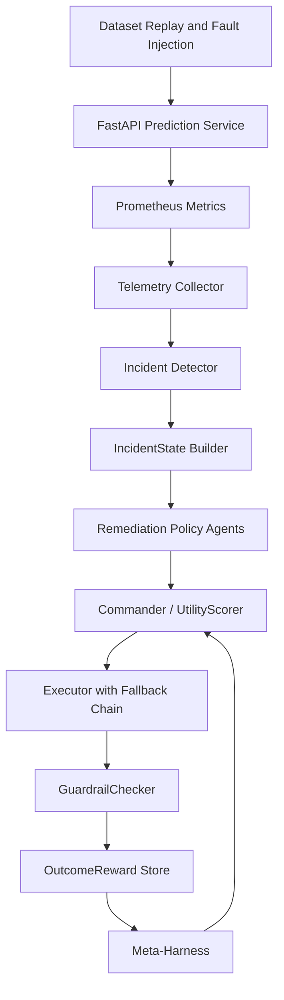

# Autonomous ML Operations Control Plane

A closed-loop ML operations system that detects model and data incidents,
evaluates competing remediation strategies using tenant-specific utility
weights, executes the selected action, and verifies whether the incident
was actually resolved — rolling back automatically if guardrails fail.

Production ML incidents rarely have one obvious fix: a quality drop might
call for a new threshold, a retrain, a rollback, a fallback policy, or a
data repair, and those options differ in cost, risk, execution time, and
expected impact. This project explores whether five specialized
remediation agents can compete across those tradeoffs while a central
commander selects and verifies the best action — replaying real dataset
traffic through a live prediction service, computing severity and reward
from measured Prometheus telemetry rather than mocked values, and
re-tuning its own decision weights offline from accumulated outcomes.
465 tests, all 17 build phases complete.

---

## System Architecture

```
Dataset Replay / Fault Injection
              │
              ▼
     FastAPI Prediction Service  ─── Prometheus metrics
              │
              ▼
      Telemetry Collector
              │
              ▼
   Incident Detector (4 types)
              │
              ▼
       IncidentState Builder ──── SQLite (policy DB, model registry)
              │
              ▼
  ┌──────────────────────────────┐
  │   Remediation Policy Agents  │
  │ Threshold │ Retrain │ Rollback│
  │ Fallback  │ DataRepair        │
  └──────────────────────────────┘
              │
              ▼
          Commander
     (UtilityScorer + optional
      LangGraph reconciliation)
              │
              ▼
    Execute ──► Fallback chain ──► Escalation
              │
              ▼
      Stabilization window
              │
              ▼
       GuardrailChecker
   resolved? no_regression?
   should_rollback?
              │
              ▼
    OutcomeReward (SQLite)
              │
              ▼
    Meta-Harness (offline batch)
   WeightTuner ─► CanaryManager
```



---

## Scope and Simulation Boundaries

### Implemented as real system behavior

- LightGBM model training and inference
- FastAPI prediction endpoint with measured latency
- UCI dataset rows replayed as real prediction requests
- Prometheus metric instrumentation and live querying
- Calculated feature drift scores and data-quality metrics
- Windowed model-quality metrics (AUC, precision, recall)
- Tenant-specific configuration and SLA persistence in SQLite
- Threshold updates written to the configuration store
- Model retraining against held-out validation data
- Model version rollback switching active model in registry
- Multi-objective proposal ranking via UtilityScorer
- Post-action state snapshot and guardrail verification
- Auto-rollback when guardrails fail and regression detected
- Outcome reward and evidence bundle persistence

### Simulated

- Production traffic source (historical dataset replay, not live)
- Tenant business profiles (documented cost model, not real billing)
- Infrastructure cost (calculated per prediction, not cloud metered)
- Fault injection (controlled scripts, not spontaneous failures)
- Upstream warehouse repair (replay environment, not real pipeline)
- Production-scale deployment infrastructure

The environment is simulated, but telemetry is computed from actual model
requests and injected data conditions rather than generated as random mock
values.

---

## Remediation Policy Agents

Five agents compete rather than chat: **Threshold** adjusts the decision
threshold in place, **Retrain** trains and registers a new model version,
**Rollback** restores the prior version when a recent deploy regressed,
**Fallback** switches to a rule-based policy when the primary path is
unhealthy, and **DataRepair** fixes corrupted input data — each with its
own eligibility gate, expected effects, confidence estimate, and risk.
Full per-agent eligibility rules, decision-flow diagrams, and the proposal
contract are in [docs/policy-agents.md](docs/policy-agents.md).

---

## Commander

The commander does not select on confidence alone — it converts each
proposal's expected effects into a tenant-specific, per-incident-type
weighted utility score (quality, reliability, cost, speed, confidence,
minus risk), and reconciles top-2 near-ties with an LLM debate rather than
using the LLM for primary decisions. Full scoring formula, weight tables,
and reconciliation logic: [docs/policy-agents.md](docs/policy-agents.md#commander-scoring).

---

## Results

| Policy | Resolution | Mean Reward | Guardrail Violations |
|---|---:|---:|---:|
| **Adaptive commander** | **75%** | **0.346** | **50%** |
| Highest confidence | 58% | 0.285 | 50% |
| Always retrain | 50% | 0.186 | 75% |
| Fixed priority | 33% | 0.143 | 67% |
| Cheapest eligible | 33% | 0.143 | 67% |

Computed from 12 scenarios × 5 policies = 60 deterministic trials
(`tests/test_policy_comparison.py`). Scenario list, per-scenario failure
modes, and the statistical caveat: [docs/evaluation.md](docs/evaluation.md).

---

## Example End-to-End Scenario

1. A replay batch for `enterprise` introduces drift in payment-history features.
2. Prometheus reports maximum feature drift of `1.84`.
3. Windowed ROC-AUC falls from `0.773` to `0.701`.
4. Incident detector raises a high-severity drift incident (severity 0.81).
5. Threshold, retrain, and rollback agents submit proposals.
6. Commander scores: retrain utility 0.62, threshold 0.21, rollback 0.38.
7. Commander selects retrain (enterprise weights: quality 0.40 highest).
8. LightGBM candidate trained, validation gates pass, `v4` registered.
9. Traffic replayed through new model.
10. Stabilisation window elapses; Prometheus re-queried.
11. GuardrailChecker: AUC 0.758 ≥ min_auc 0.75 ✓, latency 88ms ≤ SLA ✓,
    missing 2% ≤ limit ✓ → `resolved = True`.
12. Reward `0.64` stored with before/after evidence bundle.

---

## Quick Start

### Prerequisites
- Python 3.12+, `uv` package manager
- Docker + Docker Compose (Prometheus + Grafana)

### Setup

```bash
uv sync
uv run python scripts/train.py          # Train baseline model on UCI dataset
```

### API and Monitoring

```bash
docker-compose up -d                    # Prometheus + Grafana
uv run python -m uvicorn src.self_healing_pipeline.api.main:app --reload
```

- API: `http://localhost:8000/health`
- Prometheus: `http://localhost:9090`
- Grafana: `http://localhost:3000` (admin/admin)

### Replay Traffic and Trigger an Incident

```bash
uv run python scripts/replay.py
uv run python scripts/trigger_incidents.py --once
```

### Run Demo

```bash
uv run python -m src.self_healing_pipeline.demo    # single incident, full 3-layer pipeline
uv run python scripts/tune_weights.py               # tune + apply from accumulated evidence
```

Run the first command a few times to accumulate evidence, then the second —
weights change live in `tenant_tier_config`, and the next incident's agent
ranking reflects it.

---

## Documentation

| Doc | Covers |
|---|---|
| [docs/incident-detection.md](docs/incident-detection.md) | Severity formulas, evidence schema, thresholds, observability, fault injection |
| [docs/policy-agents.md](docs/policy-agents.md) | Each of the 5 agents in depth, decision-flow diagrams, commander scoring |
| [docs/verification.md](docs/verification.md) | Guardrails, auto-rollback logic, reward calculation |
| [docs/meta-harness.md](docs/meta-harness.md) | Evidence bundles, weight tuning, t-tests, canary rollout |
| [docs/evaluation.md](docs/evaluation.md) | 12-scenario suite, baseline comparison, statistical caveats |
| [docs/storage.md](docs/storage.md) | DB schema, SQLite/Postgres, configuration, repository layout |
| [docs/testing.md](docs/testing.md) | 465 tests, edge cases, integration-test notes |

---

## Limitations

- Traffic is historical replay, not live production traffic.
- The UCI dataset is small and tabular; results may not generalise to
  high-dimensional or streaming data.
- Drift detection uses normalised mean shift; PSI and KS tests are not yet
  implemented.
- Cost values use a documented simulation model, not real cloud billing.
- Labels are assumed available immediately; delayed or partial label arrival
  is not modelled.
- SQLite is appropriate for local demonstration, not high-concurrency
  production deployment.
- The data-repair action operates on the replay environment, not a real
  upstream data warehouse.
- Meta-harness tuning is currently global, not per-tenant — the same
  tuned weights are applied to every tenant, which can overwrite a
  tenant's deliberate cost/quality tradeoff (see
  [docs/meta-harness.md](docs/meta-harness.md)).
