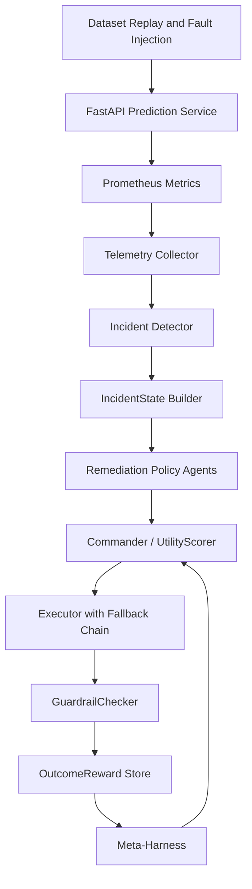
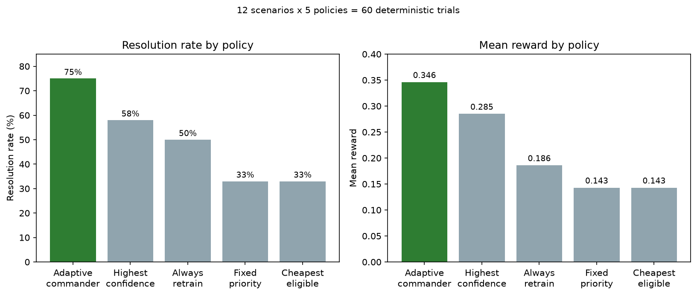

# Autonomous ML Operations Control Plane

## TL;DR

A closed-loop ML operations system that detects model and data incidents,
evaluates competing remediation strategies using tenant-specific utility
weights, executes the selected action, and verifies whether the incident
was actually resolved — rolling back automatically if guardrails fail.

Production ML incidents rarely have one obvious fix: a quality drop might
call for a new threshold, a retrain, a rollback, a fallback policy, or a
data repair, and those options differ in cost, risk, execution time, and
expected impact. Five specialized remediation agents compete across those
tradeoffs while a central commander selects and verifies the best action —
replaying real dataset traffic through a live prediction service,
computing severity and reward from measured Prometheus telemetry rather
than mocked values, and re-tuning its own decision weights offline from
accumulated outcomes.

**465 tests, all 17 build phases complete.**

---

## Architecture



Source: [assets/architecture.md](assets/architecture.md). Full mechanics
per component: [docs/implementation.md](docs/implementation.md).

---

## Example Workflow

1. A replay batch for `enterprise` introduces drift in payment-history features.
2. Prometheus reports maximum feature drift of `1.84`.
3. Windowed ROC-AUC falls from `0.773` to `0.701`.
4. Incident detector raises a high-severity drift incident (severity 0.81).
5. Threshold, retrain, and rollback agents submit proposals.
6. Commander scores: retrain utility 0.62, threshold 0.21, rollback 0.38.
7. Commander selects retrain (enterprise weights: quality 0.40 highest).
8. LightGBM candidate trained, validation gates pass, `v4` registered.
9. Traffic replayed through new model.
10. Stabilisation window elapses; Prometheus re-queried.
11. GuardrailChecker: AUC 0.758 ≥ min_auc 0.75 ✓, latency 88ms ≤ SLA ✓,
    missing 2% ≤ limit ✓ → `resolved = True`.
12. Reward `0.64` stored with before/after evidence bundle.

Sequence diagram: [assets/workflow.md](assets/workflow.md).

---

## Key Engineering Decisions

- **Utility scoring instead of confidence-only ranking** — confidence
  measures "how sure is this agent in itself," not "is this the right fix
  for this tenant." Multi-objective utility (quality + reliability + cost
  + speed + confidence − risk, weighted per incident type and tenant) was
  the single highest-leverage change: 75% vs. 58% resolution rate against
  a highest-confidence baseline.
- **LLM used only as a tie-breaker** — invoked only when top-2 utility
  scores are within 10%. Core decisions stay deterministic and
  explainable; the system runs fully without an API key.
- **Guardrails are authoritative, reward is descriptive** — the resolution
  verdict comes from explicit boolean guardrail checks, not from crossing
  a reward threshold, so several small wins can't average away one real
  SLA violation.
- **Reward from measured deltas only** — never from an agent's
  self-reported expected effect, so an agent can't grade its own homework.
- **Offline batch tuning + canary, not online learning** — auditable and
  reversible for an inference-time decision system, at the cost of not
  being a continuous feedback loop. This took two separate fixes to
  actually reach production — see below.

Full rationale for each: [docs/design.md](docs/design.md).

---

## Results



| Policy | Resolution | Mean Reward | Guardrail Violations |
|---|---:|---:|---:|
| **Adaptive commander** | **75%** | **0.346** | **50%** |
| Highest confidence | 58% | 0.285 | 50% |
| Always retrain | 50% | 0.186 | 75% |
| Fixed priority | 33% | 0.143 | 67% |
| Cheapest eligible | 33% | 0.143 | 67% |

Computed from 12 scenarios × 5 policies = 60 deterministic trials
(`tests/test_policy_comparison.py`). Scenario list, per-scenario failure
modes, and the statistical caveat: [docs/evaluation.md](docs/evaluation.md).

---

## Lessons Learned

- **"Tested" and "wired together" are different claims** — the
  meta-harness sat disconnected from the live commander for multiple
  build phases, invisible to every per-phase unit test, because none of
  them asked "does this data reach the component that's supposed to
  consume it."
- **A fix can repeat the exact mistake it's fixing, one layer down** — the
  first fix for that disconnect was itself only ever tested against a
  fake database, and stayed disconnected from production for the same
  underlying reason as the bug it fixed.
- **Verification is the load-bearing part, not the decision logic** — an
  autonomous system is only as trustworthy as its ability to check its
  own work.
- **Habitually checking `git status` catches self-introduced bugs fast** —
  an early version of the evidence-bundle wiring defaulted to always-on
  and silently wrote real files into the project directory on every test
  run; found by noticing 23 untracked folders that shouldn't have existed.

Full write-ups: [docs/lessons_learned.md](docs/lessons_learned.md) ·
[docs/bug_diary.md](docs/bug_diary.md).

---

## Quick Start

### Prerequisites
- Python 3.12+, `uv` package manager
- Docker + Docker Compose (Prometheus + Grafana)

### Setup

```bash
uv sync
uv run python scripts/train.py          # Train baseline model on UCI dataset
```

### API and Monitoring

```bash
docker-compose up -d                    # Prometheus + Grafana
uv run python -m uvicorn src.self_healing_pipeline.api.main:app --reload
```

- API: `http://localhost:8000/health`
- Prometheus: `http://localhost:9090`
- Grafana: `http://localhost:3000` (admin/admin) — panel list: [assets/dashboards.md](assets/dashboards.md)

### Replay Traffic and Trigger an Incident

```bash
uv run python scripts/replay.py
uv run python scripts/trigger_incidents.py --once
```

### Run Demo

```bash
uv run python -m src.self_healing_pipeline.demo    # single incident, full 3-layer pipeline
uv run python scripts/tune_weights.py               # tune + apply from accumulated evidence
```

Run the first command a few times to accumulate evidence, then the second —
weights change live in `tenant_tier_config`, and the next incident's agent
ranking reflects it.

---

## Documentation

| Doc | Covers |
|---|---|
| [docs/design.md](docs/design.md) | Why: engineering decisions and rejected alternatives |
| [docs/implementation.md](docs/implementation.md) | How: formulas, schemas, per-agent decision flows, DB schema |
| [docs/evaluation.md](docs/evaluation.md) | Scenario suite, baseline comparison, results detail |
| [docs/methodology.md](docs/methodology.md) | Scope boundaries, baseline definitions, statistical methodology, test approach |
| [docs/bug_diary.md](docs/bug_diary.md) | Chronological record of real bugs found and fixed |
| [docs/lessons_learned.md](docs/lessons_learned.md) | Distilled takeaways from the bug diary |
| [assets/architecture.md](assets/architecture.md) | Architecture diagram source |
| [assets/workflow.md](assets/workflow.md) | Example-workflow sequence diagram |
| [assets/results.png](assets/results.png) | Baseline comparison chart |
| [assets/dashboards.md](assets/dashboards.md) | Grafana panel reference |

---

## Limitations

- Traffic is historical replay, not live production traffic.
- The UCI dataset is small and tabular; results may not generalise to
  high-dimensional or streaming data.
- Drift detection uses normalised mean shift; PSI and KS tests are not yet
  implemented.
- Cost values use a documented simulation model, not real cloud billing.
- Labels are assumed available immediately; delayed or partial label arrival
  is not modelled.
- SQLite is appropriate for local demonstration, not high-concurrency
  production deployment.
- The data-repair action operates on the replay environment, not a real
  upstream data warehouse.
- Meta-harness tuning is currently global, not per-tenant — the same
  tuned weights are applied to every tenant, which can overwrite a
  tenant's deliberate cost/quality tradeoff (see
  [docs/design.md](docs/design.md)).
