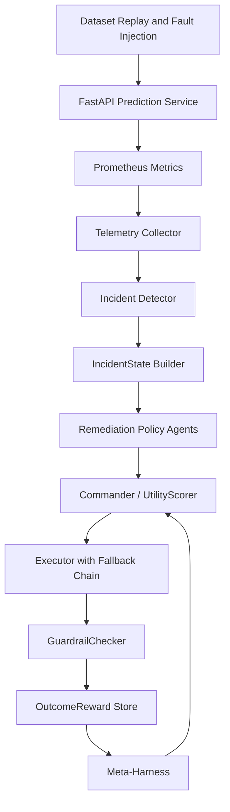

# Architecture Diagram

```mermaid
flowchart TD
    A[Dataset Replay and Fault Injection] --> B[FastAPI Prediction Service]
    B --> C[Prometheus Metrics]
    C --> D[Telemetry Collector]
    D --> E[Incident Detector]
    E --> F[IncidentState Builder]
    F --> G[Remediation Policy Agents]
    G --> H[Commander / UtilityScorer]
    H --> I[Executor with Fallback Chain]
    I --> J[GuardrailChecker]
    J --> K[OutcomeReward Store]
    K --> L[Meta-Harness]
    L --> H
```

Source of truth for this diagram — edit here, not inline in README, so it
doesn't drift into three different versions.
