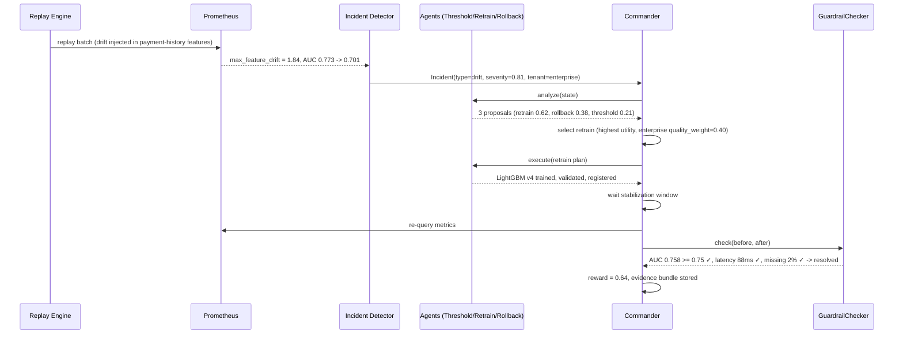

# Example Workflow Diagram

The end-to-end scenario from README, as a sequence diagram: drift incident
on `enterprise` → retrain selected → verified → resolved.

Also see [../docs/policy-agents.md](../docs/policy-agents.md) for the
per-agent decision-flow diagrams and [../docs/verification.md](../docs/verification.md)
for the full verification sequence (this diagram is the happy path only).
