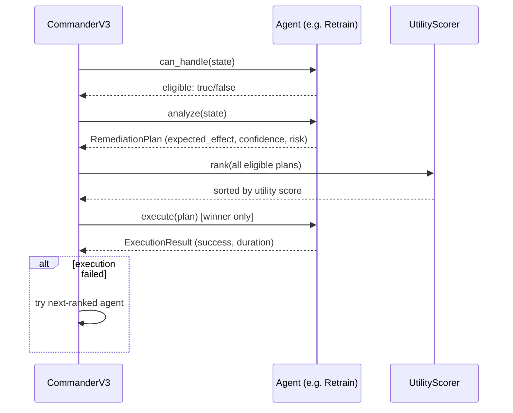
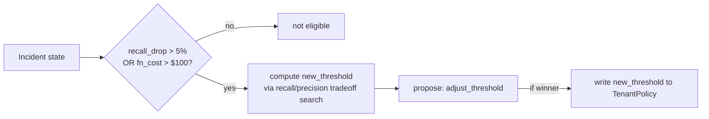
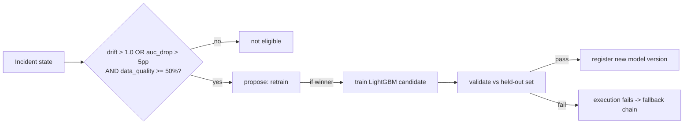
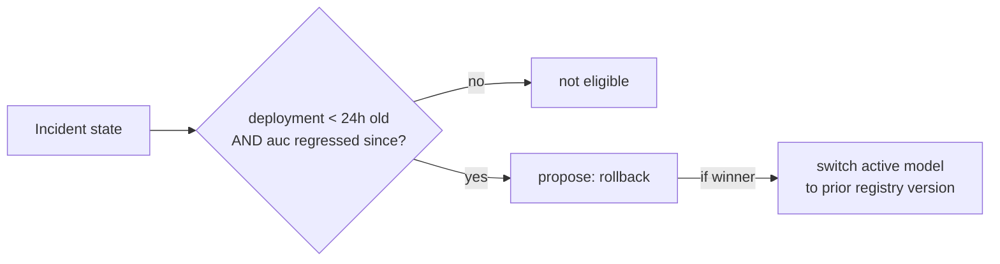
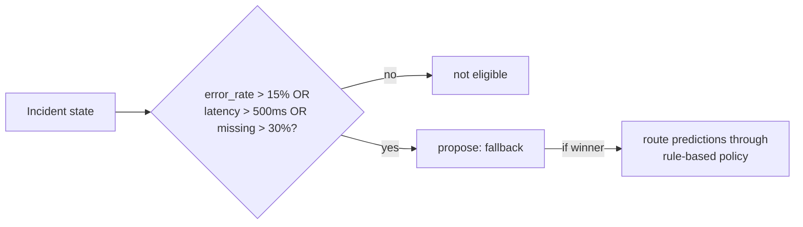
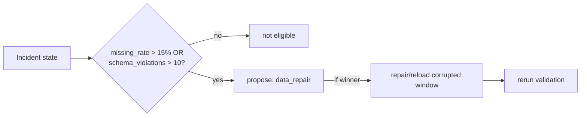
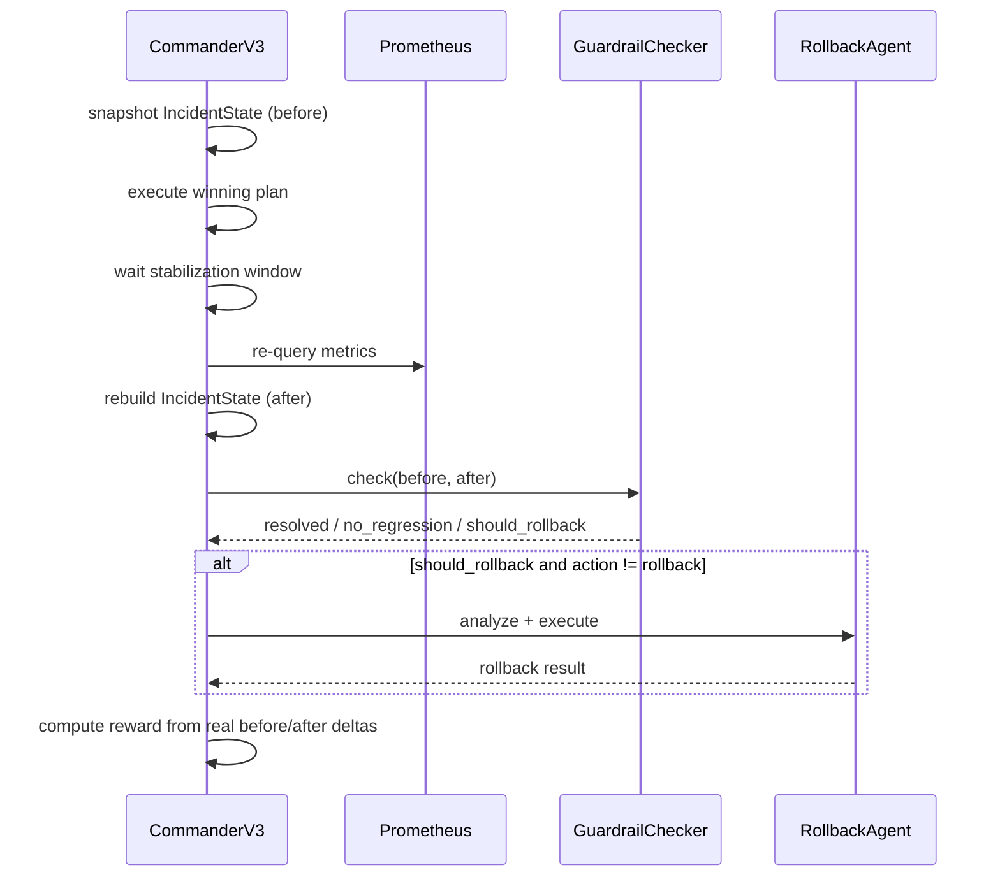
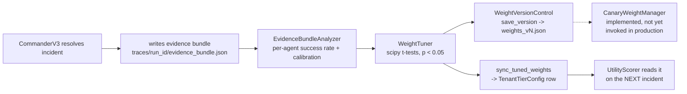

# Implementation

The concrete mechanics: formulas, schemas, sequence diagrams, code paths.
For *why* these choices were made, see [design.md](design.md).

## Contents
- [Incident Detection](#incident-detection)
- [Remediation Policy Agents](#remediation-policy-agents)
- [Commander Scoring](#commander-scoring)
- [Verification](#verification)
- [Meta-Harness](#meta-harness)
- [Storage](#storage)

---

## Incident Detection

### Evidence schema

The incident detector compares Prometheus snapshots against policy limits
from SQLite. Detected incidents carry severity, affected metrics, baseline
values, current values, and supporting evidence.

```json
{
  "tenant_id": "enterprise",
  "incident_type": "drift",
  "severity": 0.81,
  "evidence": {
    "baseline_auc": 0.773,
    "current_auc": 0.701,
    "auc_drop": 0.072,
    "max_feature_drift": 1.84,
    "drifted_features": ["LIMIT_BAL", "BILL_AMT1"]
  }
}
```

### Severity formulas

All component values are stored with the incident, not just the final
score — see [design.md](design.md#per-incident-type-severity-formulas-instead-of-one-score)
for why.

**Drift severity:**
```
0.45 × normalised AUC drop
+ 0.35 × normalised feature drift
+ 0.20 × normalised affected volume
```

**Data-quality severity:**
```
0.40 × missing + 0.25 × schema + 0.15 × duplicates + 0.20 × volume
```

**Latency severity:**
```
0.60 × latency_ratio + 0.25 × error_rate + 0.15 × traffic_volume
```

**Cost severity:**
```
0.70 × budget_overrun + 0.30 × cost_growth
```

### Observability

**Model-quality:** `ml_model_auc`, `ml_model_precision`, `ml_model_recall`,
`ml_false_positive_rate`, `ml_false_negative_rate`

**Data-quality:** `ml_missing_rate`, `ml_duplicate_rate`,
`ml_schema_violations_total`, `ml_batch_volume`, `ml_feature_drift_score`,
`ml_max_feature_drift_score`

**Prediction:** `ml_predictions_total`, `ml_prediction_latency_seconds`,
`ml_prediction_errors_total`, `ml_positive_predictions_total`

**Control-plane:** `ml_remediation_proposals_total`, `ml_agent_wins_total`,
`ml_incidents_total`, `ml_remediation_duration_seconds`,
`ml_remediation_reward`, `ml_current_decision_threshold`

Metrics are labeled by tenant and model version; high-cardinality values
(request IDs) are intentionally excluded. Live dashboards:
[../assets/dashboards.md](../assets/dashboards.md).

### Fault injection

| Scenario | Mechanism |
|---|---|
| Covariate drift | Multiply high-importance feature values |
| Missing-data incident | Set selected fields to null |
| Duplicate-data incident | Repeat rows within the replay window |
| Schema incident | Remove required fields |
| Latency incident | Add controlled delay inside inference path |
| Cost incident | Increase traffic volume beyond budget |

```bash
uv run python scripts/replay.py
uv run python scripts/trigger_incidents.py --once
```

---

## Remediation Policy Agents

Every agent goes through the same three calls from `CommanderV3`:
`can_handle(state)` (eligibility gate) → `analyze(state)` (produces a
`RemediationPlan`) → `execute(plan)` (only called on the winner, or the
next-ranked agent if the winner's execution fails).



Proposal contract every agent returns from `analyze()`:

```json
{
  "agent_type": "threshold",
  "action": "adjust_threshold",
  "new_threshold": 0.43,
  "expected_effect": {
    "auc_delta": 0.02,
    "false_negative_rate_delta": -0.04,
    "false_positive_rate_delta": 0.02,
    "latency_p95_delta_ms": 0.0,
    "cost_delta_usd": 0.0
  },
  "confidence": 0.78,
  "risk": 0.12
}
```

### Threshold

Gate: `recall_drop > 5%` or `fn_cost > $100`. Adjusts the tenant's active
decision threshold in place — no retraining, no deployment. Cheapest and
fastest of the five.



### Retrain

Gate: `drift > 1.0` or `auc_drop > 5pp`, and data quality above a 50% floor
(retraining on badly corrupted data is pointless). Runs the LightGBM
training pipeline, validates against held-out data, registers if it clears
validation gates.



### Rollback

Gate: current deployment < 24h old **and** AUC regressed since — looks
like a bad deploy, not organic drift. Switches to the previous approved
model version in the registry. No training, near-instantaneous.



Also the agent auto-invoked when post-action guardrails fail and
regression is detected — see [Verification](#verification).

### Fallback

Gate: `error_rate > 15%` or `latency > 500ms` or `missing_rate > 30%` —
the primary path is unhealthy enough that availability matters more than
accuracy right now. Routes predictions through a rule-based policy.



### DataRepair

Gate: `missing_rate > 15%` or `schema_violations > 10`. Repairs or reloads
the corrupted portion of the replay window, then reruns validation.



### Summary table

| Agent | Action | Eligibility Gate | Key Expected Effects |
|---|---|---|---|
| Threshold | Adjust decision threshold | recall_drop > 5% or fn_cost > $100 | `new_threshold`, `false_positive_rate_delta`, `false_negative_rate_delta` |
| Retrain | Train and register new model | drift > 1.0 or auc_drop > 5pp, data quality ≥ 50% | `auc_delta`, `cost_delta_usd` |
| Rollback | Restore prior model version | deployment < 24 h ago and AUC regressed | `auc_delta`, `false_negative_rate_delta` |
| Fallback | Switch to rule-based policy | error_rate > 15% or latency > 500 ms or missing > 30% | `latency_p95_delta_ms`, `availability_delta` |
| DataRepair | Repair or reload corrupted data | missing > 15% or schema errors > 10 | `missing_rate_delta`, `false_negative_rate_delta` |

### Fallback chain and escalation

If the selected agent's execution fails, `CommanderV3` tries the
next-ranked agent by utility score, in order. If all eligible agents fail,
an escalation record is written instead of retrying indefinitely.

---

## Commander Scoring

```
utility =
  quality_weight     × clip(auc_delta / 0.10)
+ reliability_weight  × clip(–fnr_delta / fnr_baseline)
+ cost_weight        × clip(–cost_delta / cost_ref)
+ speed_weight       × clip(–latency_delta / sla)
+ confidence_weight  × plan.confidence
– risk_weight        × plan.risk
```

Per-incident-type weight defaults:

| Incident | quality | reliability | cost | speed |
|---|---:|---:|---:|---:|
| Drift | 0.40 | 0.15 | 0.05 | 0.05 |
| Data quality | 0.10 | 0.35 | 0.05 | 0.05 |
| Latency | 0.05 | 0.10 | 0.05 | 0.40 |
| Cost | 0.10 | 0.10 | 0.40 | 0.05 |

Weights are per-tenant, loaded from `TenantTierConfig` — see
[Meta-Harness](#meta-harness) for how they get tuned over time. When top-2
utility scores are within 10%, a LangGraph reconciliation debate compares
guardrails, historical success, and predicted side effects instead of
taking the raw top score.

---

## Verification

### Execution

- **Threshold** — updates tenant's active threshold in SQLite
- **Retrain** — runs the LightGBM pipeline, validates candidate, registers new version
- **Rollback** — switches tenant to previous approved model version in registry
- **Fallback** — routes predictions through a rule-based policy
- **DataRepair** — repairs the corrupted replay window and reruns validation

### Verification sequence



1. Record pre-action `IncidentState` snapshot
2. Execute the remediation
3. Wait for the stabilisation window
4. Re-query Prometheus
5. Rebuild post-action `IncidentState`
6. Run `GuardrailChecker` against explicit policy limits
7. Accept or trigger auto-rollback

### Guardrails

**Resolution guardrails** (must all pass):
```
AUC    ≥ min_auc
latency ≤ latency_sla_ms
missing ≤ max_missing_rate
```

**Regression guardrails** (vs. before-action baseline):
```
cost    ≤ before × 1.10
FNR     ≤ before + 0.05
```

### Auto-rollback logic

If both guardrail sets fail, `should_rollback = True` and the rollback
agent is invoked automatically — but only if a rollback agent is available
and the triggering action wasn't already a rollback (avoids an infinite
rollback-triggers-rollback loop). This is the one place in the system
where an agent runs without having won the initial utility ranking.

### Outcome-based reward

```json
{
  "reward": 0.65,
  "components": {
    "quality_gain": 0.52,
    "reliability_gain": 0.18,
    "cost_gain": 0.04,
    "latency_gain": 0.00,
    "resolution_score": 0.80,
    "exec_cost_penalty": -0.04,
    "time_penalty": -0.01,
    "regression_penalty": 0.0
  }
}
```

`resolution_score` and the four `*_gain` components come from the real
before/after `IncidentState` diff; `exec_cost_penalty` and `time_penalty`
account for the cost/duration of taking the action; `regression_penalty`
fires when a regression guardrail failed even if the primary incident
resolved.

---

## Meta-Harness



1. `CommanderV3` writes an evidence bundle
   (`traces/run_<incident_id>/evidence_bundle.json`) after every incident,
   when constructed with a `bundle_writer` (opt-in, off by default).
2. `EvidenceBundleAnalyzer` reads bundles; computes per-agent success rates
   and confidence calibration accuracy.
3. `WeightTuner` applies scipy binomial t-tests (`p < 0.05`) and adjusts
   `ScoringWeights` only when the difference is statistically significant.
4. `meta_harness/apply.py::sync_tuned_weights()` writes tuned weights into
   each tenant's `TenantTierConfig` row — the same row
   `UtilityScorer.weights_from_tier_config()` reads live.
5. `CanaryWeightManager` rolls new weights to a configurable traffic share
   with automatic rollback on underperformance — implemented and tested,
   not yet invoked by the production entrypoint (step 4 applies directly).

### Evidence bundle schema

```json
{
  "incident": {"id": "...", "tenant_id": "enterprise", "type": "drift", "severity": 0.81},
  "all_proposals": [{"agent_type": "retrain", "confidence": 0.78, "risk": 0.12}],
  "winner": {"agent_type": "retrain", "utility": 0.62},
  "execution_result": {"success": true, "duration": 12.4},
  "reconciliation": {"winner_type": "retrain", "confidence": 0.7}
}
```

`reconciliation` is `null` when top-2 utility scores weren't close enough
to trigger a debate.

### Running it

```bash
uv run python scripts/tune_weights.py            # analyze -> tune -> version -> apply
uv run python scripts/tune_weights.py --dry-run   # analyze/tune only, no writes
```

Tenants are discovered from real `IncidentHistory` rows, not a hardcoded
list.

### Known round-trip gaps

`historical_success_weight` has a `TenantTierConfig` column and gets
written, but no `UtilityWeights` field reads it back.
`UtilityWeights.reliability` has no `TenantTierConfig` column at all — it
always falls back to the per-incident-type default regardless of tuning.

---

## Storage

SQLite is used as the persistent control-plane store.

| Table | Purpose |
|---|---|
| `tenant_policy` | SLAs, cost limits, agent eligibility |
| `tenant_tier_config` | Commander utility weights per tenant |
| `model_validation_report` | Registered model versions and AUC |
| `runtime_deployment_profile` | Latency benchmarks per version |
| `incident_history` | Detected incidents with severity |
| `remediation_action` | Selected actions, outcomes, rewards |

SQLite was chosen for portability and local reproducibility. The
interfaces could be backed by PostgreSQL without changing agent or
commander logic — `docker-compose.yml` already has a Postgres service
defined as the prod-shaped path; swapping `DB_URL` doesn't touch agent or
commander code (not yet load-tested).

### Configuration

| Variable | Default | Description |
|---|---|---|
| `ANTHROPIC_API_KEY` | `""` | Claude API key (optional — heuristic-only mode without it) |
| `DB_URL` | `sqlite:///./pipeline.db` | control-plane database connection |
| `PROMETHEUS_URL` | `http://localhost:9090` | Prometheus HTTP API |
| `API_HOST` | `127.0.0.1` | API bind host |
| `API_PORT` | `8000` | API bind port |
| `LOG_LEVEL` | `INFO` | logging verbosity |
| `USE_REPLAY_FIXTURES` | `false` | use recorded fixtures instead of live replay |
| `HAIKU_MODEL` | `claude-haiku-4-5-20251001` | model used for lightweight LLM calls |
| `SONNET_MODEL` | `claude-sonnet-4-6` | model used for reconciliation debates |

Set via `.env` file or environment. See
`src/self_healing_pipeline/config/settings.py`.

### Repository structure

```
src/self_healing_pipeline/
├── agents/              # 5 specialist agents
├── commander/           # CommanderV3, UtilityScorer, LangGraph reconciliation
├── gateway/             # Incident events, API gateway
├── meta_harness/        # Offline weight optimisation (analyzer, tuner, canary, apply)
├── monitors/            # Drift, quality, business monitors
├── observability/       # IncidentState, SeverityCalculator, TelemetryCollector
├── verification/        # RewardCalculator (OutcomeReward), GuardrailChecker
└── api/                 # FastAPI endpoints

scripts/
├── train.py               # train baseline model on UCI dataset
├── replay.py               # replay UCI test set through live prediction API
├── trigger_incidents.py    # watch Prometheus, fire real incidents into CommanderV3
└── tune_weights.py         # analyze evidence -> tune -> version -> apply to live DB
```
