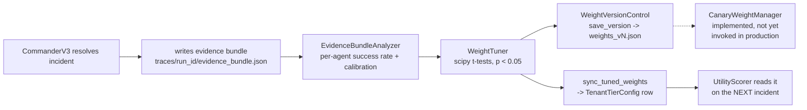

# Policy Adaptation (Meta-Harness)

The meta-harness is an **offline batch system**, not a real-time learning
loop. It re-tunes the Commander's per-tenant utility weights from
accumulated incident outcomes, only when a performance difference is
statistically significant — not by gradient descent, not continuously.

## Pipeline



1. `CommanderV3` writes an evidence bundle
   (`traces/run_<incident_id>/evidence_bundle.json`) after every incident it
   resolves — winner, all proposals, execution result, reconciliation
   outcome. Opt-in via a `bundle_writer` constructor arg, off by default so
   unit tests don't write into the real `traces/` directory.
2. `EvidenceBundleAnalyzer` reads those bundles; computes per-agent success
   rates and confidence calibration accuracy.
3. `WeightTuner` applies scipy binomial t-tests (`p < 0.05`) and adjusts
   `ScoringWeights` only when the performance difference is statistically
   significant. High performers get a confidence-weight boost; low
   performers get reduced. No gradient descent, no neural networks.
4. `meta_harness/apply.py::sync_tuned_weights()` writes the tuned weights
   into each tenant's `TenantTierConfig` row — the same row
   `UtilityScorer.weights_from_tier_config()` reads on every live
   incident — so the next decision actually uses them.
5. `CanaryWeightManager` rolls new weights to a configurable share of
   traffic (hash-routed deterministically by `incident_id`), with automatic
   rollback if the success rate drops below `rollback_threshold`.
   Implemented and tested, but not yet invoked by the production
   entrypoint below — `scripts/tune_weights.py` applies directly.

## Evidence bundle schema

```json
{
  "incident": {"id": "...", "tenant_id": "enterprise", "type": "drift", "severity": 0.81},
  "all_proposals": [{"agent_type": "retrain", "confidence": 0.78, "risk": 0.12}],
  "winner": {"agent_type": "retrain", "utility": 0.62},
  "execution_result": {"success": true, "duration": 12.4},
  "reconciliation": {"winner_type": "retrain", "confidence": 0.7}
}
```

`reconciliation` is `null` when the top-2 utility scores weren't close
enough to trigger a debate.

## Running it

```bash
uv run python scripts/tune_weights.py            # analyze -> tune -> version -> apply
uv run python scripts/tune_weights.py --dry-run   # analyze/tune only, no writes
```

Tenants are discovered from real `IncidentHistory` rows in the DB, not a
hardcoded list — so the script only touches tenants that actually had
incidents.

## The gap this closed

For a while `WeightTuner`'s output and the live `UtilityScorer` were two
systems that shared a naming convention (`business_value_weight` etc.) and
nothing else — nothing ever wrote tuned values back into the DB row the
commander reads. A first fix (`meta_harness/apply.py::sync_tuned_weights()`)
closed the field mapping but was only ever exercised against a throwaway
in-memory DB inside a demo script — still never touched production. A
second, deeper gap sat under that: the live commander never wrote evidence
bundles in the first place, so even a production entrypoint would have
analyzed zero real incidents. Both are now fixed — `CommanderV3` writes
bundles when given a `bundle_writer`, and `scripts/tune_weights.py` runs
the full cycle against the real database. Verified live: firing the same
incident repeatedly picked one agent every time; after running the tuning
script, the winner changed for the same incident.

## Known round-trip gaps

Two `ScoringWeights` dimensions don't fully reach live scoring yet:
- `historical_success_weight` has a `TenantTierConfig` column and gets
  written, but no `UtilityWeights` field reads it back.
- `UtilityWeights.reliability` has no `TenantTierConfig` column at all —
  it always falls back to the per-incident-type default regardless of
  tuning.

## Future Work

- Contextual-bandit policy learning from verified outcomes
- Per-tenant meta-harness tuning — currently applies one globally-tuned
  weight set to every tenant, which can silently overwrite a tenant's
  deliberate cost/quality tradeoff. The evidence-bundle analyzer also pools
  all incidents together rather than segmenting by tenant. Correct fix is
  per-tenant analysis and per-tenant application, not a global broadcast.
