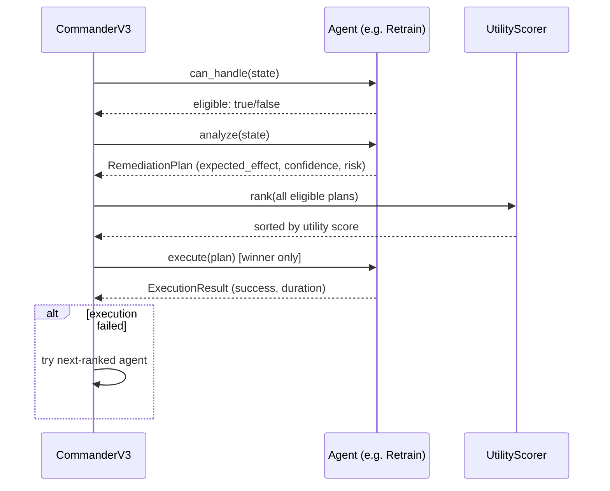
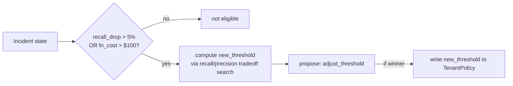
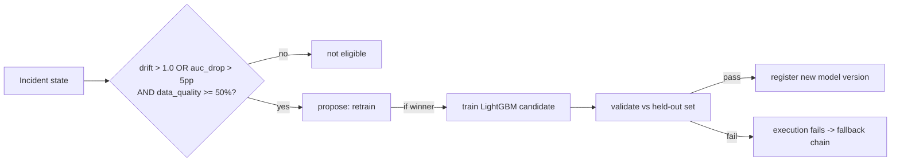
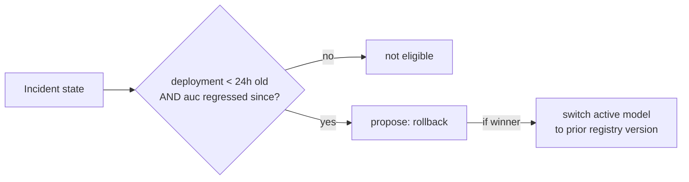
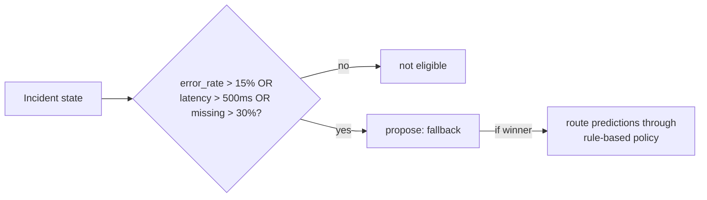
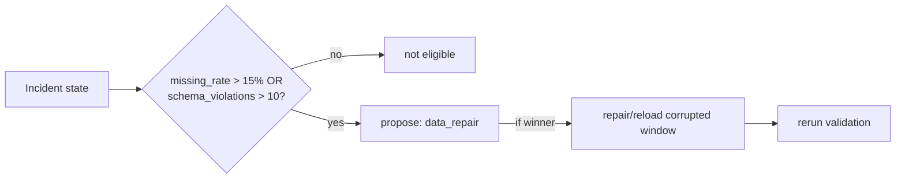

# Remediation Policy Agents

Five agents, each a distinct remediation strategy with its own eligibility
rule, state inputs, expected effects, confidence estimate, execution cost,
and operational risk. Agents do not communicate with each other — they each
independently propose a plan to the Commander, which scores and picks one.

## Shared proposal/execution flow

Every agent goes through the same three calls from `CommanderV3`:
`can_handle(state)` (eligibility gate) → `analyze(state)` (produces a
`RemediationPlan`) → `execute(plan)` (only called on the winner, or on the
next-ranked agent if the winner's execution fails).



Proposal contract every agent returns from `analyze()`:

```json
{
  "agent_type": "threshold",
  "action": "adjust_threshold",
  "new_threshold": 0.43,
  "expected_effect": {
    "auc_delta": 0.02,
    "false_negative_rate_delta": -0.04,
    "false_positive_rate_delta": 0.02,
    "latency_p95_delta_ms": 0.0,
    "cost_delta_usd": 0.0
  },
  "confidence": 0.78,
  "risk": 0.12
}
```

---

## Threshold

**Eligibility gate:** `recall_drop > 5%` or `fn_cost > $100`.

**Action:** adjusts the tenant's active decision threshold in place — no
retraining, no deployment. Cheapest and fastest of the five agents.

**Key expected effects:** `new_threshold`, `false_positive_rate_delta`,
`false_negative_rate_delta`.



---

## Retrain

**Eligibility gate:** `drift > 1.0` or `auc_drop > 5pp`, and data quality
above a 50% floor (retraining on badly corrupted data is pointless).

**Action:** runs the LightGBM training pipeline on current data, validates
the candidate against held-out data, registers the new version if it clears
validation gates.

**Key expected effects:** `auc_delta`, `cost_delta_usd`.



---

## Rollback

**Eligibility gate:** current deployment is less than 24 hours old **and**
AUC has regressed since that deployment — i.e. this looks like a bad deploy,
not organic drift.

**Action:** switches the tenant to the previous approved model version in
the registry. No training involved, close to instantaneous.

**Key expected effects:** `auc_delta`, `false_negative_rate_delta`.



Rollback is also the auto-invoked agent when post-action guardrails fail
and regression is detected — see [verification.md](verification.md).

---

## Fallback

**Eligibility gate:** `error_rate > 15%` or `latency > 500ms` or
`missing_rate > 30%` — anything indicating the primary path is unhealthy
enough that availability matters more than accuracy right now.

**Action:** routes predictions through a simpler rule-based policy instead
of the ML model, trading some accuracy for guaranteed availability and low
latency.

**Key expected effects:** `latency_p95_delta_ms`, `availability_delta`.



---

## DataRepair

**Eligibility gate:** `missing_rate > 15%` or `schema_violations > 10`.

**Action:** repairs or reloads the corrupted portion of the replay window,
then reruns validation to confirm the fix landed.

**Key expected effects:** `missing_rate_delta`, `false_negative_rate_delta`.



---

## Summary table

| Agent | Action | Eligibility Gate | Key Expected Effects |
|---|---|---|---|
| Threshold | Adjust decision threshold | recall_drop > 5% or fn_cost > $100 | `new_threshold`, `false_positive_rate_delta`, `false_negative_rate_delta` |
| Retrain | Train and register new model | drift > 1.0 or auc_drop > 5pp, data quality ≥ 50% | `auc_delta`, `cost_delta_usd` |
| Rollback | Restore prior model version | deployment < 24 h ago and AUC regressed | `auc_delta`, `false_negative_rate_delta` |
| Fallback | Switch to rule-based policy | error_rate > 15% or latency > 500 ms or missing > 30% | `latency_p95_delta_ms`, `availability_delta` |
| DataRepair | Repair or reload corrupted data | missing > 15% or schema errors > 10 | `missing_rate_delta`, `false_negative_rate_delta` |

## Fallback chain and escalation

If the selected agent's execution fails, `CommanderV3` tries the
next-ranked agent (by utility score), in order. If all eligible agents
fail, an escalation record is written instead of retrying indefinitely.

---

## Commander Scoring

The commander does not select on confidence alone. It converts each
proposal's expected effects into a tenant-specific utility score:

```
utility =
  quality_weight     × clip(auc_delta / 0.10)
+ reliability_weight  × clip(–fnr_delta / fnr_baseline)
+ cost_weight        × clip(–cost_delta / cost_ref)
+ speed_weight       × clip(–latency_delta / sla)
+ confidence_weight  × plan.confidence
– risk_weight        × plan.risk
```

Per-incident-type weight defaults:

| Incident | quality | reliability | cost | speed |
|---|---:|---:|---:|---:|
| Drift | 0.40 | 0.15 | 0.05 | 0.05 |
| Data quality | 0.10 | 0.35 | 0.05 | 0.05 |
| Latency | 0.05 | 0.10 | 0.05 | 0.40 |
| Cost | 0.10 | 0.10 | 0.40 | 0.05 |

Weights are per-tenant, loaded from `TenantTierConfig` — see
[meta-harness.md](meta-harness.md) for how they get tuned over time.

When top-2 utility scores are within 10%, a LangGraph reconciliation debate
compares guardrails, historical success, and predicted side effects instead
of taking the raw top score.
