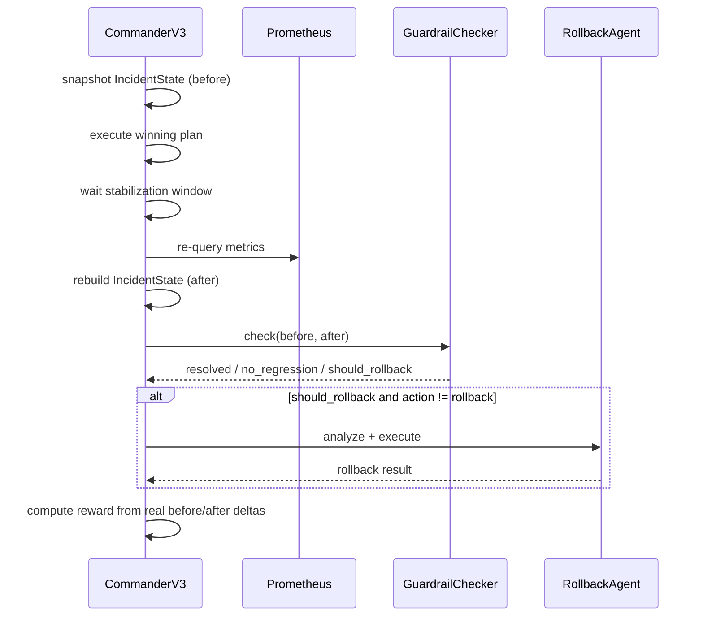

# Post-Action Verification

An action is not considered successful because it executed without error.
This is the layer that checks whether the fix actually worked — the part of
the system that makes "self-healing" a real claim instead of a marketing
name.

## Execution

Selected remediations produce actual state changes:

- **Threshold** — updates tenant's active threshold in SQLite
- **Retrain** — runs the LightGBM pipeline, validates candidate, registers new version
- **Rollback** — switches tenant to previous approved model version in registry
- **Fallback** — routes predictions through a rule-based policy
- **DataRepair** — repairs the corrupted replay window and reruns validation

If the selected agent fails, a fallback chain tries the next-ranked agent.
If all agents fail, an escalation record is written.

## Verification sequence



1. Records pre-action metric snapshot (`IncidentState` before)
2. Executes the remediation
3. Waits for the stabilisation window
4. Re-queries Prometheus
5. Rebuilds post-action `IncidentState`
6. Runs `GuardrailChecker` against explicit policy limits
7. Accepts or triggers auto-rollback

---

## Guardrails

**Resolution guardrails** (must all pass):
```
AUC    ≥ min_auc
latency ≤ latency_sla_ms
missing ≤ max_missing_rate
```

**Regression guardrails** (vs before-action baseline):
```
cost    ≤ before × 1.10
FNR     ≤ before + 0.05
```

`GuardrailChecker` is authoritative over the reward threshold for the
resolution verdict — reward is descriptive, guardrails are the actual gate.

---

## Auto-Rollback Logic

If both guardrail sets fail, `should_rollback = True` and the rollback
agent is invoked automatically — but only if:
- a rollback agent is available, and
- the action that triggered the failure wasn't already a rollback (avoids
  an infinite rollback-triggers-rollback loop).

This is the one place in the system where an agent runs without having won
the initial utility ranking — it's a safety backstop, not a competing
proposal.

---

## Outcome-Based Reward

Agent estimates are used for selection only; reward is computed strictly
from measured before/after state, never from what the agent predicted.
Naively trusting agent-reported expected effects would let an agent "grade
its own homework."

```json
{
  "reward": 0.65,
  "components": {
    "quality_gain": 0.52,
    "reliability_gain": 0.18,
    "cost_gain": 0.04,
    "latency_gain": 0.00,
    "resolution_score": 0.80,
    "exec_cost_penalty": -0.04,
    "time_penalty": -0.01,
    "regression_penalty": 0.0
  }
}
```

`resolution_score` and the four `*_gain` components come from the real
before/after `IncidentState` diff; `exec_cost_penalty` and `time_penalty`
account for the cost/duration of taking the action at all;
`regression_penalty` fires when a regression guardrail failed even if the
primary incident resolved.
